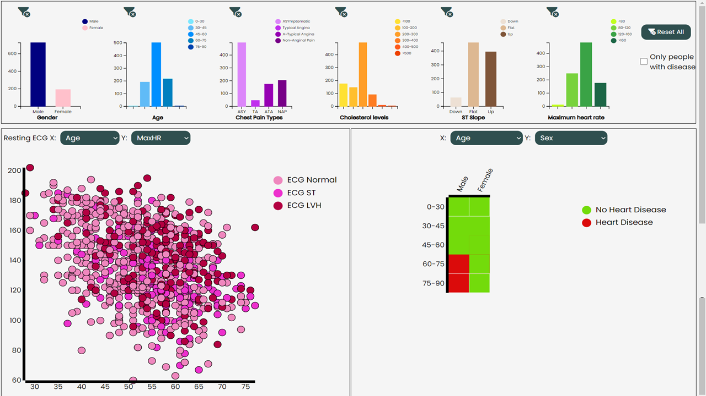

# VisualAnalytics
Cardiovascular diseases (CVDs) are the number 1 cause of death globally, taking an estimated 17.9 million lives each year, which accounts for 31% of all deaths worldwide. 4 out of 5 CVD deaths are due to heart attacks and strokes, and one-third of these deaths occur prematurely in people under 70 years of age. 

People with cardiovascular disease or who are at high cardiovascular risk (due to the presence of one or more risk factors such as hypertension, diabetes, hyperlipidaemia or already established disease) need early detection and management wherein a machine learning model can be of great help for doctors, especially cardiologists.

The idea is to create an interactive dashboard that allows to see the different elements that may contribute to a heart failure, in order to detect and prevent possible diseases. 
It will be possible to monitor different elements, such as cholesterol, blood pressure, chest pain, maximum heart rate, etc... according to age and sex of the different people.


This code consists of:
- a Web APIs **app.py** implemented using Python and **Flask**[^1] for the backend and **html, css, javascript and d3.js** for the frontend.

[^1]: For further information how to create Web APIs with Python and Flask, please refer to the following link: https://programminghistorian.org/en/lessons/creating-apis-with-python-and-flask#setting-up .


## Dataset
The dataset used in this project is from Kaggle[^2] and describes heart failure prediction. It includes a csv file, **heart.csv**, which stores information about patients and contains 11 features that can be used to predict a possible heart disease, considering that heart failure is a common event caused by CVDs. Finally, there is a 12th feature which corresponds to the output class[^3].

This dataset was created by combining different datasets already available independently but not combined before. In particular, Cleveland (303 observations), Hungarian (294 observations), Switzerland (123 observations), Long Beach VA (200 observations), Stalog (Heart) Data Set (270 observations), with a final dataset of 918 observations, removing duplicates.


[^2]:https://www.kaggle.com/datasets/fedesoriano/heart-failure-prediction
[^3]: More information can be found in the [a relative link](1716809_VisualAnalytics.pdf).

## Related works
We analyzed two different papers: 
1. V. Gupta, V. Aggarwal, S. Gupta, N. Sharma, K. Sharma and N. Sharma, "Visualization and Prediction of Heart Diseases Using Data Science Framework," 2021 Second International Conference on Electronics and Sustainable Communication Systems (ICESC), 2021, pp. 1199-1202, doi: 10.1109/ICESC51422.2021.9532790 [^4].

2. Rami Lehtinen, Harri Sievänen, Jari Viik, Väinö Turjanmaa, Kari Niemelä, Jaakko Malmivuo, “Accurate detection of coronary artery disease by integrated analysis of the ST-segment depression/heart rate patterns during the exercise and recovery phases of the exercise electrocardiography test”, The American Journal of Cardiology, Volume 78, Issue 9, 1996, Pages 1002-1006, ISSN 0002-9149, https://doi.org/10.1016/S0002-9149(96)00524-3 [^5].

[^4]: https://ieeexplore.ieee.org/document/9532790
[^5]: https://www.academia.edu/28420325/Accurate_detection_of_coronary_artery_disease_by_integrated_analysis_of_the_ST_segment_depression_heart_rate_patterns_during_the_exercise_and_recovery_phases_of_the_exercise_electrocardiography_test

## Screenshot


## Requirements
The code has been tested using **Python 3.8.12** and **conda 4.10.3**. Other versions are not guaranteed to work correctly.

### To install conda
Follow this links: 
<br />
https://docs.conda.io/projects/conda/en/latest/user-guide/install/index.html
<br />
Or go directly to Miniconda: https://docs.conda.io/en/latest/miniconda.html

It should work also on Anaconda: https://docs.anaconda.com/anaconda/install/index.html

## Set Up before using the code
A. It is really suggested to use the already existing environment.
<br /> 
After downloading the file "visual.yml", open the terminal or an Anaconda Prompt, change directory to go to the location where the file is located and do the following steps:

1. Create the environment from the visual.yml file:

```
conda env create -f visual.yml
```
The first line of the yml file sets the new environment's name, in this case "visual"
<br />
2. Activate the new environment: 
```
conda activate visual
```

3. Verify that the new environment was installed correctly:

```
conda env list
```
or 
```
conda info --envs.
```

B. Unzip the **"fontawesome-free-6.1.0-web.zip"** in **/static**

## To use the code
1. Open the terminal or Anaconda Prompt.
2. Activate "visual".
3. Change directory to go in the folder downloaded.
4. Run: ```python app.py```.
6. Go to your browser on http://127.0.0.1:8888/
